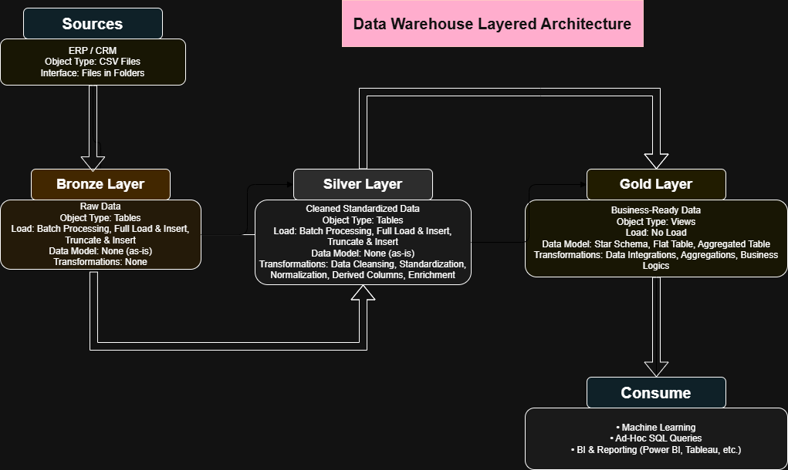

# Data Warehouse Engineering Project

Welcome! This repository highlights my end-to-end expertise in architecting, building, and documenting a robust data warehouse using modern best practices and a layered approach.  
This project demonstrates my ability to design scalable data architecture, develop efficient ETL pipelines, and implement dimensional modeling for enterprise data integration.

---

## 🏗️ Solution Architecture

This project features a **Medallion Architecture** with distinct Bronze, Silver, and Gold layers—each designed for scalability, maintainability, and data quality.



- **Bronze Layer:** Implemented to capture raw, unfiltered ERP and CRM data from CSV sources in SQL Server, enabling traceability and auditability from ingestion onward.
- **Silver Layer:** Developed robust cleansing and standardization routines to resolve quality issues and harmonize datasets, ensuring analytics readiness and schema consistency.
- **Gold Layer:** Engineered a star schema with well-defined fact and dimension tables, preparing business-ready, high-performance data structures for downstream analytics and BI (modeling focus only).

---

## 📖 Project Highlights

- **Architected a modern data warehouse:** Designed and built a robust medallion architecture (Bronze, Silver, Gold) tailored for unified ERP and CRM integration.
- **Developed automated ETL pipelines:** Created modular, reusable SQL Server/T-SQL scripts for ingesting, cleansing, and transforming data across all layers.
- **Implemented dimensional modeling:** Engineered a star schema with clear fact/dimension separation for scalability and analytical performance.
- **Ensured high data quality:** Addressed data consistency, deduplication, and type conversion through rigorous Silver-layer processing.
- **Comprehensive documentation:** Delivered technical diagrams, schema files, and metadata for clear stakeholder communication and rapid onboarding.

---

## 🛠️ Tools & Technologies Used

- **SQL Server Express & SSMS:** Managed, developed, and executed all database and ETL operations.
- **T-SQL Scripting:** Engineered extraction, transformation, and loading logic.
- **Draw.io:** Designed and documented data models, ETL flows, and layered architecture diagrams.
- **Git & GitHub:** Version-controlled all scripts and documentation for project reliability.
- **Notion:** Structured project planning, requirements documentation, and milestone tracking.
- **CSV (ERP & CRM):** Used as primary source data for all ingestion and integration processes.

---

## 🚀 Project Scope

- **Unified ERP & CRM Data:** Integrated disparate source systems using automated ETL pipelines and SQL Server, transforming raw CSV data into a single, cohesive warehouse model.
- **Data Quality Management:** Addressed missing values, duplicates, and inconsistent types to ensure high-integrity Silver layer outputs.
- **Star Schema Modeling:** Designed and implemented a gold layer star schema (fact and dimension tables) for analytics-readiness and future scalability.
- **Layered Pipeline Design:** Maintained clear separation between ingestion (bronze), transformation (silver), and modeling (gold) to maximize maintainability and transparency.
- **Technical Documentation:** Produced comprehensive diagrams, schema docs, and metadata for both technical and business stakeholders.

---

## 📂 Repository Structure

```text
data-warehouse-project/
│
├── datasets/                  # Source ERP and CRM datasets (CSV)
├── docs/                      # Diagrams, schema docs, metadata
│   ├── data_models.drawio         # ERD/star schema diagrams
│   ├── data_architecture.drawio   # Architecture diagrams
│   ├── data_flow.drawio           # Data flow diagrams
│   └── ...                        # Additional docs
├── scripts/                   # ETL and transformation SQL scripts
│   ├── bronze/                # Raw data ingestion
│   ├── silver/                # Cleansing & transformation
│   ├── gold/                  # Star schema creation
├── tests/                     # Data quality validation scripts
├── README.md                  # Project overview (this file)
└── requirements.txt           # Tooling/dependencies

```

## 📊 Data Model – Gold Layer

The Gold Layer of this warehouse is designed using a **star schema** for optimal performance and scalability.

- **fact_sales:** Central fact table containing sales transactions, referencing customer and product keys.
- **dim_customers:** Dimension table with customer master data (e.g., demographics, identifiers).
- **dim_products:** Dimension table with product master data (e.g., categories, cost, product line).

*Full data model diagrams and ERDs are available in [`/docs/data_models.drawio`](docs/data_models.drawio).*

---

## 👤 About

**Jaymin Patel**  
Data Analyst specializing in modern data warehousing and ETL pipeline development.

[](https://www.linkedin.com/in/jaymin7/)

---

## 🙏 Credits

**Huge thanks to [Baraa Salkini](https://www.youtube.com/@datawithbaraa) for the outstanding inspiration and project methodology!**  
This project would not have been possible without the clear explanations and best practices shared on the channel.

[](http://bit.ly/3GiCVUE)

---

## 🛡️ License

Licensed under the [MIT License](LICENSE).
